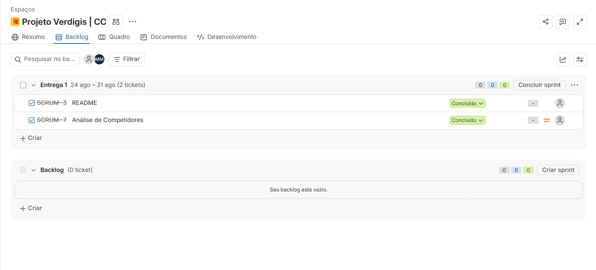
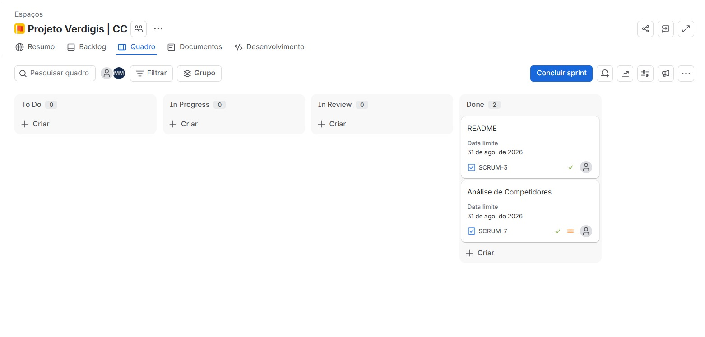
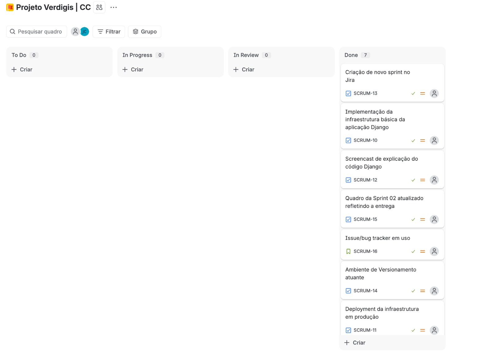

# Verdigis

Plataforma web para aumentar a percepção de valor e a adoção de práticas ESG em pequenas e médias empresas (PMEs). Projeto desenvolvido a partir de um desafio proposto pela Deloitte.

**Site:** https://projeto-verdigis.onrender.com

## Sobre o projeto

A pergunta do desafio: como aumentar a percepção de importância e impulsionar a aplicação de práticas ESG nas PMEs?

Muitas PMEs já adotam práticas sustentáveis e sociais sem reconhecê-las como ESG, e tendem a ver o tema como custo, não como vantagem competitiva. O Verdigis busca traduzir os pilares ESG para a realidade dessas empresas, mostrar o que elas já fazem e evidenciar o retorno dessas práticas.

### Contexto

- As micro, pequenas e médias empresas respondem por 26,5% do PIB e por cerca de 80% dos empregos no país.
- 67% delas não conhecem formalmente o significado da sigla ESG.
- Investidores, instituições financeiras e grandes empresas passaram a considerar critérios ESG em decisões de crédito, aporte e contratação de fornecedores.

### Barreiras identificadas

- Percepção de ESG como custo sem retorno garantido
- Foco em caixa e operação de curto prazo
- Falta de direcionamento prático sobre por onde começar
- Dificuldade em mensurar o retorno das ações
- Impressão de que a exigência recai apenas sobre grandes empresas

### Riscos da não adoção

Perda de contratos, crédito mais caro, exposição reputacional e dificuldade de atrair e reter profissionais.

## Funcionalidades

- Páginas institucionais: início, quem somos, sobre o projeto e fale conosco
- Apresentação dos pilares ESG (Ambiental, Social e Governança) com práticas associadas a cada um
- Formulário de contato com registro das mensagens no banco de dados
- Conteúdo, equipe, pilares e tecnologias editáveis pelo painel administrativo do Django, sem alteração de código

| Rota | Descrição |
| --- | --- |
| `/` | Página inicial |
| `/quem-somos/` | Equipe e apresentação do grupo |
| `/sobre-projeto/` | Objetivos, pilares, práticas e tecnologias |
| `/fale-conosco/` | Formulário de contato |
| `/admin/` | Painel administrativo |

---

## Stack

| Camada | Tecnologia |
| --- | --- |
| Back-end | Python, Django 6.1 |
| Front-end | HTML, CSS, JavaScript (templates Django) |
| Banco de dados | SQLite (desenvolvimento), PostgreSQL (produção) |
| Servidor | Gunicorn, WhiteNoise (arquivos estáticos) |
| Hospedagem | Render |

## Executando localmente

Requisitos: Python 3.12 ou superior e Git.

```bash
git clone https://github.com/jpedrosmenezes/Projeto-Verdigis.git
cd Projeto-Verdigis

python -m venv .venv
source .venv/bin/activate        # Windows: .venv\Scripts\activate

pip install -r requirements.txt
```

Crie um arquivo `.env` na raiz do projeto:

```env
SECRET_KEY=<uma-chave-secreta-qualquer>
ENVIRONMENT=development
```

Aplique as migrações, crie um superusuário e inicie o servidor:

```bash
python manage.py migrate
python manage.py createsuperuser
python manage.py runserver
```

A aplicação ficará disponível em http://127.0.0.1:8000. O conteúdo das páginas é cadastrado em http://127.0.0.1:8000/admin/.

### Variáveis de ambiente

| Variável | Obrigatória | Descrição |
| --- | --- | --- |
| `SECRET_KEY` | Sim | Chave secreta do Django |
| `ENVIRONMENT` | Sim | `development` usa SQLite local; qualquer outro valor usa PostgreSQL |
| `DATABASE_URL` | Em produção | URL de conexão do PostgreSQL |

## Deploy

O deploy é feito no Render. O script `build.sh` instala as dependências, coleta os arquivos estáticos e aplica as migrações:

```bash
./build.sh
```

Configure `SECRET_KEY`, `ENVIRONMENT` e `DATABASE_URL` como variáveis de ambiente do serviço e use `gunicorn verdigis.wsgi` como comando de inicialização.

---

## Estrutura do repositório

```
.
├── verdigis/       Configuração do projeto Django (settings, urls, wsgi)
├── forum/          App principal: models, views, templates e admin
├── hello/          App inicial de teste
├── docs/           Documentação (benchmark de concorrentes)
├── sprint/         Capturas de backlog, sprints e bug tracker
├── staticfiles/    Saída do collectstatic
├── build.sh        Script de build para deploy
└── requirements.txt
```

---

## Entrega 01:

* [Benchmark - Análise de Competidores](./docs/analisedecompetidores.md)

---

### BackLog


### Quadro do 1º Sprint



## Entrega 02:

### Quadro do 2º Sprint


### Link do Site: 
[Link para o site](https://projeto-verdigis.onrender.com)

### Screencast de explicação do código Django
[Link para o vídeo](https://youtu.be/IaMJn3oHWg4)
(Legendas disponíveis no YouTube)

---

## Equipe

Estudantes de Ciências da Computação, CESAR School.

- Ana Luiza Carvalho Xavier
- Carlos Henrique Corrêa de Araújo Soares de Sousa
- Carlos Vinicius Encarnação do Nascimento
- João Marcelo Franca da Costa Casado
- João Pedro dos Santos Menezes
- Lucas de Moura Mattos
- Matheus Raulino de Souza Moreira
- Pétala Kiara da Silva
- Thácio Soares Miranda dos Santos
- Vitória de Assis Seabra

Parceiro do desafio: Deloitte
